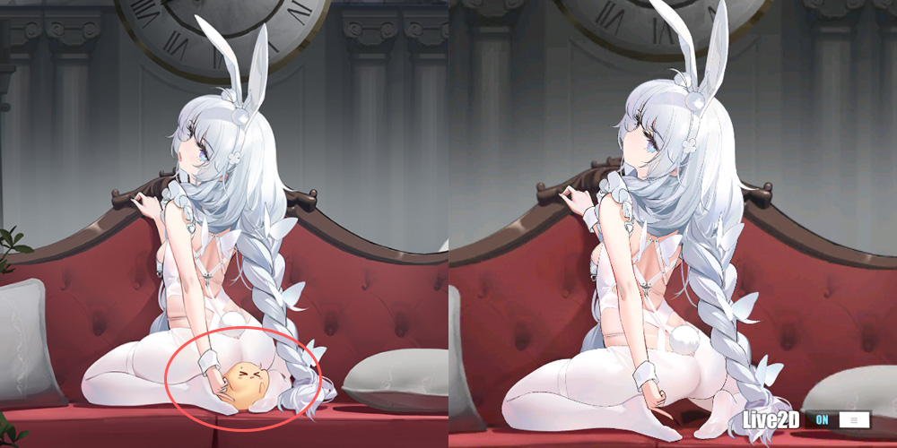

# Introduction

根据个人口味魔改了碧蓝航线（中国服）的部分立绘，目的是使其更加好用(?)

本仓库托管了这些修改过的资源文件

# Installation

- ❗️ 在使用之前请确保你理解：

  - 使用 mod 是修改游戏客户端的行为
  - 请不要在任何中国大陆公共平台讨论本仓库
  - 请不要公开传播包含 mod 的截图或视频

- 根据口味，将你想要的立绘的资源文件放进对应文件夹中，其中

  - `live2d` 文件夹包含 Live2D 立绘文件，这些文件应放在 `/storage/emulated/0/Android/data/com.bilibili.azurlane/files/AssetBundles/live2d` 中覆盖原文件
  - `painting` 文件夹包含静态立绘文件，这些文件应放在 `/storage/emulated/0/Android/data/com.bilibili.azurlane/files/AssetBundles/painting` 中覆盖原文件

# Make your edit

如果你想自行修改（其他立绘），可以尝试利用以下工具

- `UnityLive2DExtractor` 提取贴图
- `Live2D Cubism Viewer` 预览效果
- `Unity Assets Bundle Extractor` 打包

具体请参考 [notes.md](https://github.com/Elypha/azurlane-mod/blob/main/notes.md)

# List

请参阅下方表格找到对应立绘文件

| 舰娘 | 文件 | 立绘 | 预览 |
| :---: | :---: | :---: | :---: |
| 恶毒 | edu_4 | 懒懒的白兔 |  |
| 伊丽莎白女王 | yilishabai_6 | Maid·My·Highness |  |
| 岛风 | daofeng_5 | 不思议国度的白兔 |  |
|  |  | | |
